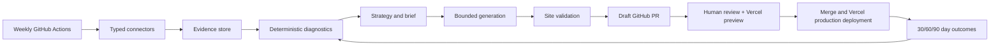

# Agentic SEO Growth Engine

Evidence-backed weekly SEO intelligence for a GitHub/Vercel website. The MVP normalizes five provider feeds, ranks SEO and conversion opportunities, produces reviewed briefs, bounds generated site changes, validates the target site, and measures post-deployment outcomes.

## What is implemented

- Typed domain contracts and SQLAlchemy/Alembic persistence for runs and observations.
- Fixture-tested connector boundaries for Google Search Console, GA4, Microsoft Clarity, Firecrawl, and DataForSEO.
- Deterministic diagnostics for striking-distance keywords, content gaps, decay, friction, and strategy ranking.
- Strategy comparison, evidence-backed briefs, provider-neutral structured generation, and policy gates against prompt injection, unsupported claims, secrets, excessive diffs, and unsafe paths.
- Static-site validation for titles, descriptions, canonicals, H1s, JSON-LD, and internal links.
- GitHub branch/commit/draft-PR delivery adapter and 30/60/90-day measurement utilities.
- FastAPI read-only health/status surface and Typer commands for collection, diagnosis, brief generation, and weekly orchestration.
- CI, Monday 13:00 UTC scheduling, artifact upload, provider setup, Vercel/GitHub approval, and rollback runbook.

The fixture workflow is executable without credentials. Live provider execution is intentionally guarded until credentials, production database, provider request implementations, and deployment governance are configured.

## Quick start

```powershell
uv sync --dev
Copy-Item .env.example .env
uv run seo-engine --help
uv run seo-engine run-weekly --fixture --run-date 2026-09-29
uv run pytest -q
uv run ruff check .
uv run alembic check
```

The fixture run writes an evidence-backed brief under `artifacts/briefs/` and is idempotent for the same site and date. Provider credentials are optional for fixture mode and must never be committed.

## Architecture



The detailed architecture, whiteboard comparison, threat model, and data contracts are in [the design spec](docs/superpowers/specs/2026-09-29-seo-growth-engine-design.md). The Phase 0 ecosystem research is in [the open-source accelerator report](docs/research/2026-09-29-open-source-seo-accelerators.md), and the executable implementation plan is in [the MVP plan](docs/superpowers/plans/2026-09-29-seo-growth-engine-mvp-plan.md).

## CLI and API

```text
seo-engine health
seo-engine collect [--fixture] [--run-date YYYY-MM-DD]
seo-engine diagnose [--fixture] [--run-date YYYY-MM-DD]
seo-engine generate-brief [--fixture] [--run-date YYYY-MM-DD]
seo-engine run-weekly [--fixture] [--run-date YYYY-MM-DD]
```

FastAPI exposes `GET /healthz` and `GET /runs/{run_id}`. Manual triggering remains CLI-only; the API is read-only in the MVP.

## Operations

- [Provider setup](docs/operations/provider-setup.md)
- [GitHub and Vercel setup](docs/operations/vercel-github-setup.md)
- [Weekly runbook](docs/operations/weekly-runbook.md)
- [MVP validation report](docs/operations/mvp-validation-report.md)

The weekly automation creates artifacts and reviewable proposals. It does not merge PRs or issue a production deployment command. Vercel production deployment occurs through the repository's normal protected-branch Git integration after human approval.

## RunRate Advisory application

The repository also contains the RunRate Advisory website application in
`app/`, with the Cloudflare Worker entrypoint in `worker/index.ts`, the
database migrations in `drizzle/`, and the deployment bindings in
`wrangler.jsonc`. The migration history includes `0007_happy_dust.sql`.
Apply production D1 migrations with `npm run cf:migrate`
only after reviewing the target account and database.

The assessment retains complete answers, the report snapshot, generated PDF,
and accepted AI/rules narrative in encrypted Cloudflare R2 storage for 90
days. The next daily cleanup removes it, normally within 24 hours after the
90-day mark. The cleanup schedule is 03:17 UTC. Compact D1 records and report objects
follow the same 90-day retention policy, while the operational mailbox follows
the same policy outside the application. Respondents can request deletion
through the contact page or by contacting info@runrategroup.com.

Assessment notifications may include the respondent's name, email, company,
role, deterministic result, and accepted narrative. OpenAI receives no
identity, raw answers, or prose; it receives only approved candidate block IDs.
Narrative prose is not stored in D1. role-null records are rejected by the
assessment record contract.
