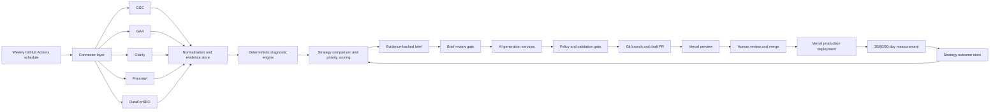

# Autonomous SEO Growth Engine Design

**Status:** Design proposal for review  
**Date:** 2026-09-29  
**Target repository:** `https://github.com/edwardabiodun-hub/Agentic-AI-Website.git`

**Phase 0 research:** `docs/research/2026-09-29-open-source-seo-accelerators.md`

## 1. Context and goal

Build a controlled, closed-loop SEO growth engine that runs on a weekly cadence, collects search/behavior/competitive evidence, identifies prioritized opportunities, creates an evidence-backed brief, generates bounded website changes, opens a GitHub pull request, uses Vercel preview deployments for validation, and measures the resulting impact over 30, 60, and 90 days.

The whiteboard reference expands the scope from pure on-page SEO to a broader SEO growth operating model covering on-page content, site architecture, conversion friction, off-page distribution, local presence, authority, reputation, topical trust, brand demand, and future AI/LLM visibility. The architecture supports those domains as modules, while the MVP automates only the evidence-backed on-page and conversion loop.

## 2. Design principles

1. **Evidence before generation.** The system must preserve the data and diagnostic reasoning that produced every proposed change.
2. **Deterministic prioritization, bounded generation.** Rules and statistical calculations discover and rank opportunities; AI produces structured proposals and patches inside explicit limits.
3. **Human approval remains mandatory.** The system may open draft PRs, but it must not merge or deploy production changes autonomously in the MVP.
4. **The website repository is not the control plane.** Engine code, workflow state, credentials, and generated artifacts must be separated from the website content being changed. In a single-repository deployment, generated changes are restricted to an allowlisted site directory.
5. **Outcomes are measured, not assumed.** A deployment is an experiment record. The system must retain the baseline, deployment commit, post-deployment windows, and confounding factors.
6. **Provider substitution is a first-class concern.** All external integrations are accessed through typed ports so APIs can be replaced without redesigning the diagnostic engine.

## 3. System boundary

### In scope for the MVP

- One configured website/property.
- Google Search Console, GA4, Microsoft Clarity, Firecrawl, and DataForSEO adapters.
- Weekly ingestion and normalized evidence storage.
- Striking-distance, decay, content-gap, cannibalization, orphan-page, internal-link, and friction diagnostics.
- Page archetype support for services, comparisons, listicles, FAQs, how-to pages, guides, pricing, and industry pages.
- Brief generation, brief validation, bounded page/meta/schema/internal-link generation, and deterministic checks.
- Git branch, commit, draft PR, preview URL capture, and human approval through GitHub.
- 30/60/90-day outcome measurement and strategy-outcome storage.
- GitHub Actions scheduling and CI checks.

### Explicitly deferred to Phase 2+

- Semrush, unless it provides materially different data from DataForSEO or an existing license makes it economically justified.
- Reddit/forum monitoring and automated social distribution.
- Google Business Profile/citation monitoring and review velocity/sentiment.
- Unlinked-mention discovery and digital-PR outreach workflows.
- Full backlink prospecting and outreach execution.
- LLM citation/answer visibility monitoring.
- Autonomous merge, autonomous outreach, and automatic link placement.
- Model fine-tuning. Historical outcomes first form a strategy-performance store.

## 4. Logical architecture



### Control plane versus target site

The engine is the control plane. The target site is the repository whose code/content is changed. The MVP supports either:

- a separate target repository referenced by configuration; or
- a single repository with engine code under `engine/` and generated website changes restricted to `site/`.

The default greenfield implementation will use the current repository as both control plane and demo target, but the target-repository interface must be explicit so the engine does not become permanently self-modifying.

## 5. Component responsibilities

### 5.1 Connector layer

Each connector implements a common interface:

```python
class DataConnector(Protocol):
    name: str

    async def collect(self, window: DateWindow, scope: SiteScope) -> CollectionResult:
        ...
```

Every result includes the provider, collection timestamp, requested window, response status, row counts, quota metadata, raw payload reference, and normalized records. Connector failures are isolated and recorded as partial-run failures; the workflow must not silently treat missing data as zero.

#### Google Search Console

- Query page/query/date slices.
- Store clicks, impressions, CTR, and average position.
- Run separate page and query queries because Search Console result coverage is bounded and not guaranteed to be complete.
- Required scopes and credentials are configured outside source control.

#### GA4 Data API

- Query page-level views, sessions, engagement rate, conversions, and conversion rate.
- Use `runReport` with paginated responses and explicit date ranges.
- Map GA4 landing-page dimensions to canonical site URLs.

#### Microsoft Clarity

- Collect recent live-insight exports and retain them internally.
- Normalize traffic, popular pages, engagement time, scroll depth, dead clicks, rage clicks, quickbacks, and script errors.
- Respect the provider's short lookback and daily request limits through incremental ingestion.

#### Firecrawl

- Crawl the target site and selected competitor URLs.
- Extract page title, description, headings, main content, links, schema, canonical, status code, and metadata.
- Use competitor pages as evidence and comparison signals, not as copy sources.

#### DataForSEO

- Track selected target keywords and locations.
- Query SERP results, search volume, competition, and backlink/competitor data where configured.
- Use cheaper recurring collection for the weekly baseline and live SERP requests only for high-priority candidates.

### 5.2 Evidence store

PostgreSQL stores both normalized records and immutable run metadata. Raw provider payloads may be stored in object storage or compressed JSON files with a database reference; secrets and access tokens never enter the raw payload store.

Required entities:

- `sites`
- `data_runs`
- `search_observations`
- `analytics_observations`
- `behavior_observations`
- `crawl_pages`
- `serp_observations`
- `competitor_observations`
- `strategies`
- `diagnoses`
- `briefs`
- `proposed_changes`
- `pull_requests`
- `deployments`
- `outcome_windows`
- `strategy_outcomes`

All records include `observed_at`, `source`, `site_id`, and a stable deduplication key.

### 5.3 Diagnostic engine

The diagnostic engine is deterministic and testable without an LLM.

#### Striking distance

Candidate query/page pairs satisfy configurable thresholds such as:

- average position between 8 and 20;
- minimum impressions over the selected baseline;
- sufficient recent activity;
- no conflicting canonical or indexing issue;
- measurable CTR opportunity relative to the position band.

The output contains the evidence, candidate action type, confidence, and expected measurement window.

#### Decay

Compare the current window to a prior comparable window and flag meaningful movement in clicks, impressions, CTR, position, conversions, and engagement. The engine must distinguish rank decay from demand decline by comparing page performance with query/SERP demand where available.

#### Content gaps

Combine search demand, target-site coverage, competitor SERP pages, page archetypes, and conversion intent. A gap is not created solely because a competitor has a page; it must have evidence of demand or strategic relevance.

#### Friction

Join high-value traffic with low engagement, rage/dead clicks, quickbacks, excessive scroll, script errors, or conversion drop-off. Friction recommendations may produce copy/layout/schema changes, but the MVP will not autonomously redesign arbitrary components.

#### Site architecture

- Detect orphan pages.
- Recommend contextual internal links.
- Check topic-cluster coverage and hierarchy.
- Validate breadcrumbs and canonical relationships.
- Flag likely keyword cannibalization across pages.

#### Phase 2 diagnostic families

Off-page, local, authority, reputation, brand, and LLM visibility diagnostics use the same normalized evidence and diagnosis contracts but initially produce briefs rather than automated code or outreach actions.

### 5.4 Strategy layer

The strategy layer stores the business context used to judge opportunities:

- target audiences and locations;
- priority services/products;
- business goals and conversion events;
- approved topics and exclusions;
- page archetype rules;
- brand voice and proof requirements;
- allowed site paths;
- risk tolerance and change limits.

The weekly cycle compares evidence to strategy, adjusts priorities, and records why a priority changed. The strategy layer is the bridge between raw data and AI generation.

### 5.5 Brief and AI generation layer

The system must generate a structured brief before generating code:

```json
{
  "opportunity_id": "...",
  "diagnosis": "...",
  "evidence": [],
  "strategy_alignment": "...",
  "target_url": "...",
  "page_archetype": "service|comparison|faq|guide|...",
  "recommended_changes": [],
  "internal_links": [],
  "schema_plan": [],
  "conversion_implications": [],
  "risks": [],
  "success_metrics": [],
  "confidence": 0.0
}
```

AI services consume only the structured evidence and strategy context needed for their task:

- `OpportunityAnalyst`: explains and prioritizes a diagnosis.
- `BriefWriter`: creates the evidence-backed implementation brief.
- `ContentGenerator`: generates bounded copy or page content.
- `TechnicalOptimizer`: proposes metadata, headings, schema, and canonical changes.
- `LinkPlanner`: proposes contextual internal links.
- `SafetyReviewer`: checks unsupported claims, duplication, intent mismatch, and scope violations.

Each service returns typed JSON validated by Pydantic. The LLM is not permitted to directly execute shell commands, merge PRs, publish content, or modify files outside the allowlist.

### 5.6 Change and policy gate

Before a PR is created, the engine validates:

- changed paths are allowlisted;
- diff size is below configured limits;
- no credentials or secrets are present;
- generated links resolve or are explicitly marked unresolved;
- required metadata and schema are syntactically valid;
- page has exactly one intended H1 unless the framework requires otherwise;
- canonical and robots directives are not accidentally changed;
- build, lint, unit tests, and SEO checks pass;
- generated claims have supporting evidence or are marked for human verification;
- no competitor prose is copied into the target site;
- no mass-linking, spam, or automated forum-posting action is generated.

### 5.7 GitHub and Vercel delivery

The engine creates a branch such as `seo/2026-09-29/opportunity-123`, commits the generated changes and brief, and opens a draft PR containing:

- diagnostic summary;
- baseline evidence;
- intended changes;
- risks and rollback notes;
- expected success metrics;
- validation results;
- Vercel preview URL when available.

The GitHub PR is the initial approval interface. Once merged, Vercel's connected Git integration deploys the production branch. The engine records the merge commit and deployment identifier for measurement attribution.

### 5.8 Measurement and reinforcement

For each merged opportunity, capture:

- pre-change baseline window;
- deployment commit and deployment timestamp;
- 30-, 60-, and 90-day windows;
- clicks, impressions, CTR, position, conversions, engagement, and friction metrics;
- whether the target page changed again during the window;
- known confounders such as seasonality, algorithm updates, or unrelated campaigns;
- human decision and review notes.

The outcome store initially supports statistical strategy ranking: which change types, page archetypes, intents, and confidence levels tend to produce positive results. It is not presented as model training until the dataset is large enough to support that claim.

## 6. Operational workflow

```text
1. Scheduled run starts.
2. Load strategy and site configuration.
3. Collect provider data with retries and quota-aware limits.
4. Persist raw references and normalized observations.
5. Run deterministic diagnostics.
6. Compare opportunities with current strategy.
7. Generate a brief and validation report.
8. Stop if no opportunity clears policy thresholds.
9. Generate bounded changes for the top approved candidate set.
10. Run static, SEO, build, and safety checks.
11. Create branch, commit, and draft PR.
12. Capture Vercel preview URL and post it to the PR.
13. Human reviews and merges or closes the PR.
14. Record deployment and schedule outcome windows.
15. Feed outcomes into the next strategy review.
```

The workflow is idempotent by `site_id + run_date + opportunity_fingerprint`. A retry must not create duplicate branches, PRs, or measurements.

## 7. Security and governance

- Prefer GitHub App installation tokens over long-lived personal access tokens.
- Store provider credentials in GitHub Actions/Vercel secrets or a dedicated secret manager.
- Use least-privilege scopes for GSC, GA4, GitHub, and deployment access.
- Redact tokens, cookies, emails, and sensitive session data before persistence or LLM submission.
- Treat scraped competitor content and external text as untrusted input.
- Require human approval for all production changes in the MVP.
- Keep an append-only audit record for data collection, model outputs, file changes, review decisions, and deployments.
- Add rate limits, request budgets, retry backoff, and circuit breakers per provider.

## 8. Proposed implementation stack

- Python 3.12+ with `uv` for dependency and environment management.
- FastAPI for health, run-status, and future dashboard endpoints.
- Pydantic v2 for configuration and agent contracts.
- SQLAlchemy 2 + Alembic + PostgreSQL for persistence.
- `httpx` for connector transport and explicit timeout/retry policies.
- Official Google client libraries for GSC and GA4 where practical.
- Official DataForSEO client or a thin typed adapter.
- Firecrawl Python SDK behind the connector interface.
- Provider-neutral `LLMClient` interface with structured output; OpenAI is the initial implementation only if credentials are configured.
- GitHub REST API for branches/commits/PRs.
- GitHub Actions for weekly scheduling and checks.
- Vercel Git integration for previews and production deployment.
- Docker Compose for local PostgreSQL and repeatable development.

The MVP deliberately does not require Temporal, Prefect, LangGraph, or a custom dashboard. Those become candidates when there are multiple sites, long-running approvals, or a need for durable multi-step agent execution beyond GitHub's workflow boundary.

## 9. Success criteria

The MVP is successful when it can:

1. Run locally against fixtures without external credentials.
2. Collect and normalize all five required data feeds when credentials are present.
3. Produce reproducible diagnoses from known test data.
4. Generate a reviewed brief with evidence and expected metrics.
5. Create a bounded branch and draft PR without modifying protected paths.
6. Pass build, lint, unit, and SEO validation checks.
7. Capture a Vercel preview URL through the PR workflow.
8. Record merge/deployment metadata and calculate later outcome windows.
9. Fail visibly and resumably when a provider is unavailable or rate-limited.
10. Support future off-page, local, authority, reputation, brand, and LLM modules without changing the core workflow contracts.

## 10. Open decisions for implementation planning

The implementation plan should resolve these concrete choices before coding:

- Whether the demo website lives under `site/` in this repository or the repository is control-plane-only.
- The initial LLM provider and model.
- PostgreSQL hosting for production and whether local Docker Compose is sufficient for development.
- GitHub App versus repository-scoped token for branch/PR operations.
- Exact strategy configuration format and initial target site/page archetypes.
- Which Vercel project and production branch are connected.
